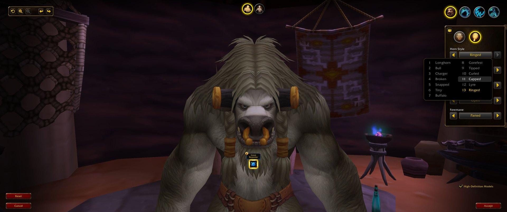

# ForeverBarberFix

Makes the barber chair usable in the **World of Warcraft: Forever** beta.



Sit down on the beta today and you get a Lua error, the Accept and Reset
buttons stay grey, and there is no way to confirm the haircut. The barber panel
is full-screen and swallows the keyboard, so you cannot even type a `/run` to
get around it. This addon fixes the one broken line before the panel is shown.
It is Blizzard's own "Barber Chairs cause a LUA error" from the beta
known-issues list.

**This is a stopgap.** Blizzard has the bug on its list, so a beta client
patch will most likely fix it soon. When that happens this addon becomes
redundant and can simply be deleted; leaving it installed does no harm.

## Install

**[Download the latest release →](../../releases/latest)**, or install it from
[CurseForge](https://www.curseforge.com/wow/addons/forever-barber-fix), and unzip it into
your Forever beta AddOns folder, so that you end up with

```
World of Warcraft\_classic_beta_\Interface\AddOns\ForeverBarberFix\ForeverBarberFix.toc
```

Then log out to the character select screen, tick **Forever Barber Fix** in the
AddOns list, and log back in. A `/reload` is not enough for a new addon folder;
the client only picks new addons up at character select.

## Check that it works

Sit in any barber chair. Chat prints

```
ForeverBarberFix: barber shop patch applied.
```

no error appears, and **Accept** lights up as soon as you change something.

Outside the chair, `/barberfix` reports whether the patch is active.

## What it fixes

The Forever client loads a Forever-specific copy of the character customize
frame that was written for the character-creation screen. One of its methods
indexes `CharacterCreateFrame`, which exists only on the login screens:

```
Blizzard_CharacterCustomize/Camelot/Blizzard_CharacterCustomize.lua:450:
attempt to index global 'CharacterCreateFrame' (a nil value)
```

In the world that global is nil. The throw happens inside the panel's OnShow,
on the way from `SetSelectedCategory` through `UpdateCameraMode` and
`UpdateZoomButtonStates` to `UpdateSmallButtons`, which is before the panel
reaches the code that enables Accept and Reset. Every option you click reruns
the same path and errors again, so the buttons never wake up. Your choices do
reach the server, because the client-side call that records them runs one line
before the failing update; only the button to submit them is dead.

## How it works

The addon replaces `CharCustomizeFrame.UpdateSmallButtons` with a guard that
returns immediately when `CharacterCreateFrame` is nil and otherwise calls the
original. Retail's version of the same file has no `UpdateSmallButtons` at all,
so in the world this is exactly the retail behaviour.

Timing is the only subtle part. The customize frame lives in a load-on-demand
Blizzard addon that is loaded by `BarberShopFrame_LoadUI()` immediately before
`ShowUIPanel(BarberShopFrame)`. A `hooksecurefunc` post-hook on that function
runs after the frame exists and before it is shown, so the first chair of the
session already works. The addon-loaded event and the barber-open event are
hooked as well, as a fallback. The barber UI calls no protected functions, so
the replaced method cannot cause "action blocked" errors elsewhere.

## When to remove it

When "Barber Chairs cause a LUA error" leaves Blizzard's known-issues list, or
when a patch note says the barber is fixed. Blizzard is working through the
beta list quickly, so expect this addon to be redundant before long. Leaving it
installed after that is harmless: the guard only changes behaviour where the
game would have thrown, and once Blizzard's file no longer throws there is
nothing left for it to do. If a later build errors in a *different* place,
please [open an issue](../../issues/new/choose) with the stack trace.

## Sources and discussion

Where the bug is tracked and discussed:

- [WoW Forever Beta Known Issues — September 18](https://us.forums.blizzard.com/en/wow/t/wow-forever-beta-known-issues-september-18/2352687)
  (US forums, Blizzard) — "Barber Chairs cause a LUA error", present since the
  September 17 list. [EU mirror](https://eu.forums.blizzard.com/en/wow/t/wow-forever-beta-known-issues-18-september/629369),
  [blue-post archive](https://arctium.io/blue-posts/775).
- [Barbershop in WoW Forever](https://us.forums.blizzard.com/en/wow/t/barbershop-in-wow-forever/2352776)
  (US forums) — players hitting the error, and confirmation that appearance
  changes do go through once submitted.
- [Permanent LUA ERRORS](https://us.forums.blizzard.com/en/wow/t/permanent-lua-errors/2352561)
  (US forums) — general beta Lua-error thread.
- Known-issues coverage: [Wowhead](https://www.wowhead.com/forever/news/wow-forever-beta-known-issues-382980),
  [Icy Veins](https://www.icy-veins.com/wow-forever/news/wow-forever-beta-known-issues-list-september-17th/),
  [WOWF.IO](https://wowf.io/en/news/beta-known-issues).
- [ClassicWoWCommunity/forever-bugs](https://github.com/ClassicWoWCommunity/forever-bugs)
  — community bug tracker for the beta.

The code the fix is based on, as published in the `forever` branch of
Gethe/wow-ui-source:

- [Blizzard_CharacterCustomize/Camelot/Blizzard_CharacterCustomize.lua](https://github.com/Gethe/wow-ui-source/blob/forever/Interface/AddOns/Blizzard_CharacterCustomize/Camelot/Blizzard_CharacterCustomize.lua)
  — `UpdateSmallButtons` at line 450, the line that throws.
- [Blizzard_BarbershopUI/Mainline/Blizzard_BarberShopUI.lua](https://github.com/Gethe/wow-ui-source/blob/forever/Interface/AddOns/Blizzard_BarbershopUI/Mainline/Blizzard_BarberShopUI.lua)
  — the panel; `UpdateCharCustomizationFrame` never reaches `UpdateButtons`.
- [Blizzard_BarbershopUI/Blizzard_BarberShopUI_Bootstrap.lua](https://github.com/Gethe/wow-ui-source/blob/forever/Interface/AddOns/Blizzard_BarbershopUI/Blizzard_BarberShopUI_Bootstrap.lua)
  — `BarberShopFrame_LoadUI`, the function the addon hooks.
- [Blizzard_CustomizationUI/Blizzard_CustomizationUI.lua](https://github.com/Gethe/wow-ui-source/blob/forever/Interface/AddOns/Blizzard_CustomizationUI/Blizzard_CustomizationUI.lua)
  — the shared base: `SetCustomizations` → `SetSelectedCategory` → `UpdateCameraMode`.
- [BarberShopDocumentation.lua](https://github.com/Gethe/wow-ui-source/blob/forever/Interface/AddOns/Blizzard_APIDocumentationGenerated/BarberShopDocumentation.lua)
  and [Warcraft Wiki: C_BarberShop.ApplyCustomizationChoices](https://warcraft.wiki.gg/wiki/API_C_BarberShop.ApplyCustomizationChoices)
  — none of the barber API is protected, which is why a plain addon can help.
- [Interface 16001 for the Forever beta](https://github.com/McTalian-WoW-Addons/RPGLootFeed/pull/617)
  — the TOC version number the client expects.

## Build a zip yourself

```bash
tools/package.sh      # dist/ForeverBarberFix-<version>.zip
```

The version comes from `## Version:` in the TOC. History: [CHANGELOG.md](CHANGELOG.md).

## Licence

MIT. World of Warcraft is a trademark of Blizzard Entertainment, Inc.
